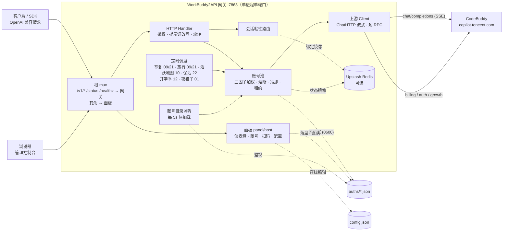

<p align="center">
  
</p>

<h1 align="center">WorkBuddy2API</h1>

<p align="center">
  <b>把 CodeBuddy 账号变成 OpenAI 兼容 API 的多账号网关</b><br>
  OAuth 登录 · 账号池轮转 · 熔断与冷却 · 会话粘性 · 积分补充
</p>

<p align="center">
  
  
  
  
  <a href="https://t.me/sliverkiss_blog"></a>
</p>

---

## 项目简介

WorkBuddy2API 是一个自托管的 **OpenAI 兼容上游网关**，将 ```CodeBuddy``` 账号包装为统一的 `/v1/chat/completions` 服务。

### 本项目做什么

- 通过 **OAuth 设备授权**（`login.sh`）获取账号凭证，在网关侧做 token 自动刷新、账号池调度与流量治理；
- 面向 **个人多账号** 场景：多账号共享、单号故障自动换号、冷却 / 熔断防止雪崩、会话粘性保证多轮上下文不跳号；
- 对客户端只暴露 OpenAI 兼容接口，现有 SDK / 前端 / 工具 **零改造接入**。

### 本项目不做什么

- **只做上游网关，不做下游协议转换** — 本项目仅负责对接上游 ```CodeBuddy``` 并暴露 OpenAI Chat 协议；Anthropic Messages、Gemini 等其他协议的适配应由下游网关负责；
- **不做多密钥分发 / 计费审计** — 面向个人多账号场景，不做下游密钥体系（每把密钥独立配额、IP 白名单、调用审计）。需要这类运营能力请用 [workbuddy-manager](https://github.com/ithtelab/workbuddy-manager)。

### 内置 Web 管理面板

本项目**内置**了第三方面板 [workbuddy2api-gui](https://github.com/287775856/workbuddy2api-gui)
（经 `git subtree` 引入到 `panel/`，出处与许可见[面板出处与维护](#面板出处与维护)），
并把它从「独立进程 + 独立端口」改为**与网关同进程、同端口**，因此只需一个容器：

| 路径 | 归属 |
|---|---|
| `/v1/*`、`/status`、`/healthz` | 网关（OpenAI 兼容接口与探活） |
| `/api/*`、`/assets/*`、`/` | 面板（Web 控制台） |

浏览器访问 `http://<地址>:7863` 即可打开控制台——账号池状态、网页 OAuth 添加账号、
批量签到 / 查积分、凭证导入、聊天测试台、`config.json` 在线编辑等，详见
[使用内置面板](#使用内置面板)。

> ⚠️ 面板持有全部账号凭据（`accessToken` / `refreshToken`），且与 API 同端口暴露。
> 部署后**第一件事就是改掉默认口令**，并置于 **HTTPS 反向代理**之后。

首次登录、页面清单、`WBGUI_*` 变量、账号热加载等完整说明见[使用内置面板](#使用内置面板)。

### 其他社区面板

- [workbuddy-manager](https://github.com/ithtelab/workbuddy-manager) — 账号管理 + 多密钥分发网关（独立部署，功能更重，适合对外提供 API）

> ⚠️ 合规须知：本项目是**非官方**网关，使用 ```CodeBuddy``` 账号作为上游，**仅限本人授权账号、本机 / 私有环境测试**。详细边界见[安全与合规](#安全与合规)。

📖 完整文档见 [GitHub Wiki](https://github.com/Sliverkiss/workbuddy2api/wiki)。

## 核心能力

### 账号池治理

- **OAuth 设备授权登录** — 两种方式任选，重复执行即可连续添加多账号，全程无 PKCE（state 由服务端签发）：
  - **容器内单命令**（宿主机零依赖）— `docker run --rm -it --entrypoint /app/login` 一次跑完取授权 URL → 浏览器登录 → token 轮询 → 首次签到 → 凭证落盘，state 只存活于进程内存，`--rm` 不会丢；
  - **`./login.sh`**（宿主机有 Go / python3）— 除上述流程外，额外支持 **global 账号的注册地区自动完善与 trial 领取**；也提供 `url` / `poll` / `realm` 子命令供脚本化调用。
- **三因子加权随机选号** — `credits 比例 ×10 + 快过期积分占比 ×8 + 闲置补偿` 三项加权（`pool.expiring_soon` 窗口内的积分优先消耗，默认 7 天），按权重降序取 **Top-5 候选短名单**，再在短名单内加权抽签（等权重候选先随机打乱防惊群、LRU 兜底覆盖全部候选），兼顾积分多、快过期积分先用掉、闲置久的账号；失败账号由熔断 / 冷却 / 连败降权状态机处置（不进权重公式）
- **防惊群** — 跳过 100ms 内刚被选中的账号，多账号同时待命时不打爆同一台
- **在途租约** — 单账号最大在途请求数（`pool.max_in_flight`）限制并发占用，占满的号不参与选号，避免单号过载
- **账本择优** — 每次成功请求按 `usage.credit` 折算每千 token 单价记入 `(账号, 模型)` 账本，免费 / 便宜的账号优先；观测按 EMA 平滑、6 小时未更新即失效（陈旧价格不复活），成本随上游活动实时变化；账本随池状态落盘 `state.json`，重启不丢学费；`/status` 透出 `model_costs` 台账（模型 / 单价 / 末次观测 / 样本数）
- **成本分层条件探索** — costTier 硬过滤（免费 > 未知 > 收费）会把全池锁死在唯一的实测免费号上：其余账号永远轮不到、也就永远学不到「它其实也免费」（垄断 + 学习冻结，issue #136）。破解方式是**搭车改道**：tier 0 垄断层存在且 tier 1 有成员时，距上次探索 ≥ `pool.cost_explore_interval`（默认 30m，`"0"` 关停）就把本次选号改道给一个未知号——承接的是完整真实用户请求，**零新增上游请求**（IP 维度零增量，WAF 友好）。成功即毕业（首观测入账，免费回 tier 0 / 收费出局 tier 2，学费只付一次）；失败走既有冷却 / 熔断策略，无探测风暴。探索频率硬性限幅 ≤ 48 次 / 天 / 模型（24h ÷ 30m），与池规模和 QPS 无关；tier 1 枯竭后自动停探。探索节奏按 `(域, 模型)` 独立；`/status` 透出 `cost_explore` 台账（累计事件数 + 各 (域, 模型) 最近探索时刻），与 `model_costs` 行对照即可读出「探索 → 毕业」全链路

### 流量治理

- **分级熔断与冷却** — 429 软冷却（600s 起指数退避、封顶 `soft_rate_max`）、404 固定浅冷却、402 / 余额耗尽硬冷却至次日 04:00、连续失败熔断（`breaker_threshold` 触发后指数退避封顶 6h）
- **模型级限流独立冷却** — 6004（该模型使用量超限）只冷却触发调用的模型，切其他模型立即可用；`/status` 透出 `rate_limited_models` 台账
- **账号临时停用 / 恢复** — 运维可把某个号临时摘出选号池、观察后再放回，不必删凭证（issue #138/#118）。语义是「对话流量摘除」而非「账号冻结」：停用期间签到、token 保活、排程任务照常执行，账号仍在池里、状态照常透出。与系统自动禁用是**两个独立状态位**（`manual_disabled` / `disabled`），各自清除、都清空才回到选号池——避免运维意图被签到解冻等自动复活路径意外解除；停用状态随池状态落盘，重启保留。入口：`/admin/accounts/{uid}/{disable,enable,revive}` 端点 + `cmd/acct` CLI（默认关闭，`admin.enabled` 显式开启）
- **状态持久化** — 池状态（积分 / 冷却 / 熔断 / 计数）本地原子落盘 `state.json`，可选镜像至 Upstash Redis，重启后择优恢复

### 请求链路

- **流式 + 非流式** — 出站强制 `stream:true`；SSE 帧按 OpenAI 规范白名单重建；非流式由本地聚合为单响应
- **DeepSeek 思维链注入** — 出站请求体注入 `thinking.type=enabled` + 默认档位，`reasoning_content` 多轮回填，`reasoning_effort` 按模型档位自动降级
- **系统提示词三模式**（`prompt.mode`，缺省 `passthrough`） —
  - `passthrough`（缺省）：透传客户端原始 system，遇内容拦截自动降级中性提示词重试
  - `custom`：网关用自有提示词**替换**客户端 system/developer（从源头消除模板句误报；不参与降级）
  - `append`：**两者并用**——开头连续 system/developer 块之后插入网关自有提示词，客户端项目规范/工具约定与网关人格共存（issue #129）；降级期与拦截首遇重试时退化为 `custom` 语义（换中性提示词，原文 system 移除）
  - `prompt.file`（custom/append 生效）指向自定义提示词文件，空 = 内置默认
- **会话头族注入** — 出站携带官方客户端会话头族（`X-Conversation-Request-ID` 聚合主键 · `X-Conversation-ID` 透传 · B3 链路），轮转 / 重试 / 路径回退复用同键，后台按对话轮聚合不再碎片化（issue #35）
- **指纹脱敏** — 出站请求体黑名单指纹字段清洗（可开关），与提示词体系两层叠加

### 选号语义

选号 = 会话粘性（命中即定）→ 成本分层（硬过滤）→ 加权随机（软均衡）三层串联，各层语义：

- **成本分层** — 账本把每个 `(账号, 模型)` 归入三档：**tier 0**（实测免费，单价 ≤ 0）、**tier 1**（无观测）、**tier 2**（实测收费）。同一次选号在**存活的最便宜档内**选：有 tier 0 就只在 tier 0 里挑，全池无免费观测才落到 tier 1，再不行才是 tier 2——即「贵号永远只作兜底」。tier 1 的号**不会被跳过**：新账号 / 新模型没跑过就没有观测，直接淘汰会把新号饿死。观测随 `usage.credit` 实时更新且 6 小时过期，所以限免窗口（如夜间免费）一结束，账号回到 tier 1 / tier 2，选号自动跟随——无需重启，日志会打 `free tier ended` 提示价格切换
- **会话粘性** — 同一对话固定走同一账号（多轮上下文不跳号、上游 prompt cache 不碎）。粘性键按此优先级取：**conversation 维度四键**（`metadata.conversation_id` / `metadata.conversationId` / `conversation_id` / `conversationId` 任一）→ **`prompt_cache_key`**（pi-ai 系客户端把会话 ID 放在这个 OpenAI 前缀缓存字段里）→ **首条 user 消息文本的 sha256 兜底**（OpenAI 兼容协议无会话 ID 字段，dsh / Codex 等客户端四键全缺，此前粘性恒不命中、逐请求换号；现由首条 user 消息派生会话级稳定键——会话内历史追加不影响该键，开新会话自然换键）。`user_id` **不是**粘性键——它会把一个用户的所有并行对话钉到同一个号上（粒度远粗于上游对话级缓存边界），发 `user_id` 的客户端回落加权轮换（**该回落同样适用于首条 user 消息兜底**：请求体带 `metadata.user_id` 或顶层 `user_id` 时不派生兜底键）。绑定 30 分钟滚动续期，空闲即过期释放
- **负载分布** — 粘性与分层都未限定时，三因子加权随机（`credits ×10 + 快过期积分 ×8 + 闲置补偿`）把流量摊开：高余额号多扛、快过期积分的号先用、闲置号补位；防惊群跳过 100ms 内刚选中的号。权重是**概率倾斜**而非硬排序（Top-5 短名单 + 名单内抽签），不会让单一账号垄断流量

### 定时积分任务

- **签到**（09 / 21 点）— 每日签到 + 余额查询，余额恢复自动解冻冷却账号
- **活跃地图**（10 点）— 对话事件连发上报点亮活跃地图与连登天数、解锁领养前置，补签卡保连登、连登档位兑换 + 抽奖、礼包/补偿领取，回读 streak 自检
- **猫猫旅行**（09 / 21 点）— 独立排程：领养 / 派出 / 领奖闭环推进
- **token 保活**（22 点）— 全账号刷新 token，session 失效连续 3 次才禁用
- **开学季任务**（12 点）— 任务点亮 + claim + 自动抽空抽奖余额，活动下线时自动跳过
- **夜猫子任务**（01 点）— 夜猫窗口（23:00–08:00 CST）内补一次 black_cat 任务

六类任务独立排程、独立开关（`schedule.*_enabled`），互不影响。

### 双域适配

- 同时适配**国内版（CN，`copilot.tencent.com` / `www.codebuddy.cn`）与国际版（Global，`www.workbuddy.ai`）**账号
- 共享同一账号池，由账号 `realm` 或请求模型名前缀（`cn:` / `global:`）决定路由；`global.enabled` 可一键锁死纯 CN 部署
- 国际版支持注册激活、地区完善、一次性 trial 加油包领取（`./trial.sh`）

### 辅助工具

- 积分日报：`./credit.sh`（美化 / `-json`，realm 感知双域）
- 手动签到：`./signin.sh`（批量、幂等不重复计）
- 账号停用 / 恢复：`./acct.sh list | disable <uid> [原因] | enable <uid> | revive <uid>`（需 `admin.enabled`，走网关管理端点）
- 领养联动 / 任务查询：`scripts/task_runner.py`（成长任务一体机，默认 dry-run）
- 个性化提示词：`prompt.file` 指向自定义提示词文件即整体替换内置默认（`custom`/`append` 模式生效）

## 架构总览



上游请求在出站前经历统一的改写管线（`internal/upstream/payload.go`）：强制 `stream:true`、`developer` 角色归一、tool_choice 归一、DeepSeek 思维链注入、`reasoning_effort` 档位降级、`reasoning_content` 回填、指纹脱敏。

## 快速开始

### 环境要求

- **Docker + Docker Compose**（推荐部署方式，镜像内已含 `app` 低权限用户与全部工具脚本）
- 一个或多个已注册的 CodeBuddy 账号，用于 OAuth 登录
- 宿主机 Go ≥ 1.22（仅源码构建时需要）

### Docker Compose 一键部署

```bash
git clone https://github.com/sofs2005/workbuddy2api.git
cd workbuddy2api
cp config.example.json config.json

# 面板登录口令（必填 —— 未设置时 compose 会直接报错退出）
echo 'WBGUI_PASSWORD=你的强口令' > .env
```

编辑 `config.json`，**至少设置 `api_key`**（`留空 = 不鉴权`，公网部署务必设置）。示例中的 `test_key` 等均为占位符，`config.example.json` 不含任何真实密钥。

> `.env` 里的 `WBGUI_PASSWORD` 是**内置面板**的登录口令，与 `api_key` 是两回事：
> `api_key` 保护 `/v1` 接口（给下游客户端用），`WBGUI_PASSWORD` 保护管理面板（给你自己用）。
> 面板能读到账号凭据，故口令必须够强；`.env` 已在 `.gitignore` 中，不会误提交。

### 登录添加账号

两种方式任选，重复执行即可连续添加多账号。凭证落在 `auths/workbuddy-<uid>.json`，账号池在容器启动时自动对齐该目录（新增文件即自动发现）。

#### 方式一：容器内单命令（推荐，宿主机零依赖）

登录工具已内置镜像（`/app/login`），**一条命令跑完整个流程**——取授权 URL → 浏览器登录 → 按 `y` → 首次签到 → 凭证落盘。宿主机不需要 Go、不需要 python3：

```bash
# 国内版（默认）
docker run --rm -it -v "$PWD/auths:/app/auths" --user root \
  --entrypoint /app/login ghcr.io/sofs2005/workbuddy2api:latest

# 国际版：追加 --realm=global
docker run --rm -it -v "$PWD/auths:/app/auths" --user root \
  --entrypoint /app/login ghcr.io/sofs2005/workbuddy2api:latest --realm=global
```

`--user root` 让登录产物能自动 `chown` 给服务进程 uid（10001），避免宿主目录属主不一致导致 token 续期回写失败；可用环境变量 `AUTH_DIR`（默认 `/app/auths`）/ `CHOWN_UID`（默认 `10001`，`0` 表示不 chown）覆盖。`login -h` 查看完整用法。

#### 方式二：`./login.sh`（宿主机有 Go / python3）

```bash
./login.sh                 # 交互式选域（默认 1/国内版 cn）
./login.sh --realm=global  # 直达国际版
./login.sh --realm=cn      # 直达国内版
```

首次运行会自动编译 `cmd/login`。相比方式一，脚本额外完成 **global 账号的注册地区自动完善与 trial 领取**（新国际版账号需先补注册地区再激活 Trial，否则 chat 报 14017），并在结束后等待热加载、回读账号数。

> **可写性预检（issue #160）**：脚本启动时会先检查 `auths/` 是否可写。若你按下方说明执行过
> `chown -R 10001:10001 ./auths`，宿主机当前用户已无写权限，此时脚本会**在打开浏览器授权前**
> 直接退出并给出容器内登录的命令 —— 不会让你白走一遍 OAuth 才发现落盘失败。

底层 `login` 命令同时提供三个子命令，便于脚本化：

```bash
login [--realm=cn|global] url     # 取授权 URL（state 落盘 /tmp，stdout 打印 URL）
login [--realm=cn|global] poll    # 用 state 换 token，stdout 输出完整 JSON
login [--realm=cn|global] realm   # 交互式选域，stdout 只输出 cn|global
```

`url` 与 `poll` 必须同一 `--realm`（state 落盘带 realm，读回校验防混域）。

#### 登录后

**无需重启**。网关后台每 5 秒比对 `auths/` 目录，发现新凭证即自动重扫入池（见下方
[使用内置面板](#使用内置面板) 的「账号热加载」）。新增账号后数秒内 `/status` 的
`total` 就会增加：

```bash
curl -s -H "Authorization: Bearer $API_KEY" http://localhost:7863/status
```

> 旧版本需要 `docker compose restart` 才能加载新账号；热加载上线后已不再需要。
> 若你确实想重启（例如改了 `config.json`），执行 `docker compose restart`。

#### 非 root 宿主用户注意（属主问题）

`./login.sh` 以**当前宿主用户**落盘凭证（权限 0600），而容器内网关以 `app(uid 10001)` 读 + 回写
（refresh / realm 补标识走 tmp+rename，需要目录写权限）。二者 uid 不同（例如 Linux 非 root 账号
通常是 uid 1000）时容器读不到凭证文件，`/status` 账号数为 0——与 `./data` 卷的属主问题同源。
登录后、启动前把目录属主交给 10001（root 或部署用户执行）：

```bash
chown -R 10001:10001 ./auths
```

之后新增账号**推荐直接用内置面板**（浏览器打开 `:7863` → 添加账号）：面板与网关同进程，
落盘的凭证属主天然是 `10001`，无需反复 chown，且 5 秒内自动入池、无需重启。

也可进容器登录（`app` 自身落盘，属主即 10001，无需反复 chown）：

```bash
docker compose exec -it wb2api bash -c './login.sh'
```

### 启动服务

```bash
docker compose up -d
```

默认拉取已构建好的镜像 `ghcr.io/sofs2005/workbuddy2api:latest`；想从源码本地构建则加 `--build`：

```bash
docker compose up -d --build
```

#### Windows 原生运行（无需 Docker）

Windows 10/11 自带的 PowerShell 与 `curl.exe` 即可管理后台进程。先准备配置并构建：

```powershell
Copy-Item config.example.json config.json
# 编辑 config.json；建议把 listen 设为 127.0.0.1:7863，且务必设置 api_key

go build -trimpath -ldflags="-s -w" -o wb2api.exe ./cmd/server
go build -trimpath -ldflags="-s -w" -o login.exe ./cmd/login
go build -trimpath -ldflags="-s -w" -o signin_bin.exe ./cmd/signin
go build -trimpath -ldflags="-s -w" -o credit.exe ./cmd/credit
```

使用仓库自带脚本在后台启停并查看状态：

```powershell
.\start-workbuddy2api.cmd
.\status-workbuddy2api.cmd
.\stop-workbuddy2api.cmd
```

PID 写入 `wb2api.pid`，标准输出与错误日志分别写入 `data/server.out.log`、
`data/server.err.log`。停止脚本会先验证 PID 对应的可执行文件确为当前目录下的
`wb2api.exe`，不会因陈旧 PID 误杀其他进程。

添加账号可使用配套管理面板，或在 Git Bash 中运行现有 `login.sh`（它还负责 CN
首次签到以及 Global 注册地区/trial 流程；不建议只手工调用 `login.exe` 后跳过这些步骤）。

### 验证

```bash
# 健康检查（无可用账号时 503）；service 字段用于确认打到的是本网关
curl -s http://localhost:7863/healthz
# {"healthy":2,"total":3,"service":"workbuddy2api"}

# 面板已挂载（免登录可调，不含敏感信息）
curl -s http://localhost:7863/api/session

# 模型列表
curl -s http://localhost:7863/v1/models -H "Authorization: Bearer your-api-key"

# 账号状态（汇总 + 每账号详情，含 disabled / manual_disabled 双位）
curl -s http://localhost:7863/status -H "Authorization: Bearer your-api-key"

# 临时停用一个账号（需 config 里 admin.enabled = true）
curl -s -X POST http://localhost:7863/admin/accounts/<uid>/disable \
  -H "Authorization: Bearer your-api-key" -H "Content-Type: application/json" \
  -d '{"reason":"观察几天"}'
# 或用 CLI（自动从 config.json 读网关地址与 key）
./acct.sh list && ./acct.sh disable <uid> 观察几天 && ./acct.sh enable <uid>

# 流式聊天
curl -sN http://localhost:7863/v1/chat/completions \
  -H "Authorization: Bearer your-api-key" \
  -H "Content-Type: application/json" \
  -d '{"model":"deepseek-v4-flash","messages":[{"role":"user","content":"hi"}],"stream":true}'

# 非流式聊天（本地聚合）
curl -s http://localhost:7863/v1/chat/completions \
  -H "Authorization: Bearer your-api-key" \
  -H "Content-Type: application/json" \
  -d '{"model":"deepseek-v4-flash","messages":[{"role":"user","content":"hi"}],"stream":false}'
```

### 使用内置面板

浏览器打开 `http://<服务器地址>:7863` 即可进入 Web 控制台（与 API 同端口，无需另开端口）。

**首次登录**：用户名 `admin`，口令默认 `workbuddy`。

> ⚠️ **请立刻修改默认口令**。面板能读到账号的 `accessToken` / `refreshToken`，等同于账号完全控制权。
> 在 `docker-compose.yml` 里设置 `WBGUI_PASSWORD`，或登录后在「系统」页网页改密码（改后吊销全部会话）。
> 公网部署**必须**置于 HTTPS 反向代理之后。

**面板能做什么**

| 页面 | 能力 |
|---|---|
| 📊 仪表盘 | 账号池可用 / 冷却 / 禁用计数、积分总览、在途与粘性会话、Token 过期预警 |
| 👥 账号管理 | 全量账号表格、状态筛选、批量签到 / 刷新 / 查积分、单账号详情（含猫档案 / 旅行状态）、手工导入凭证 |
| ➕ 添加账号 | 网页 OAuth 授权（国内版 / 国际版），自动落盘并热加载，无需重启 |
| 💬 聊天测试 | 动态模型下拉、流式 / 非流式、推理内容展示、token 用量与首字延迟 |
| ⚙️ 网关配置 | `config.json` 分组表单或 JSON 源码双模式编辑，保存前自动备份 |
| 🔧 系统 | 容器状态、面板运行信息、网页改口令、任务历史、客户端接入示例 |

**账号热加载**

面板扫码或导入的新凭证会在 **5 秒内自动进池**，无需重启容器：

- 网关后台每 5 秒比对 `auths/` 目录指纹（文件名 + 大小 + 修改时间）；
- 有变化即重新加载并同步账号池，已有账号的**积分 / 冷却 / 计数状态不受影响**；
- 手工投放凭证文件、删除凭证文件同样生效。

也可用 API 验证：

```bash
curl -s -H "Authorization: Bearer $API_KEY" http://localhost:7863/status | grep -o '"total":[0-9]*'
```

**面板配置（`WBGUI_*` 环境变量）**

面板配置**只认环境变量**，不读面板自己的 JSON 文件——避免与网关的 `config.json` 混淆。
在 `docker-compose.yml` 的 `environment:` 段设置：

| 变量 | 默认 | 说明 |
|---|---|---|
| `WBGUI_PASSWORD` | `workbuddy` | 面板登录口令（**务必修改**） |
| `WBGUI_USERNAME` | `admin` | 面板登录用户名 |
| `WBGUI_SESSION_TTL` | `12h` | 会话有效期 |
| `WBGUI_READ_ONLY` | `false` | `true` = 全局只读，关闭一切写操作（仅监控场景） |
| `WBGUI_DANGEROUS_OPS` | `false` | `true` = 解锁删除账号、恢复配置备份等高危操作 |

> 面板的 `listen` 字段在合并模式下**无效**——端口由网关的 `config.listen` 决定。
> 面板的备份与登录凭据落在 `data/backups/`、`data/gui-credentials.json`（随 `./data` 卷持久化）。

**已知限制**

「请求统计」页依赖网关 `/v1/stats` 端点，本上游未提供，故该页默认隐藏
（`panel/web/src/App.tsx` 的 `STATS_ENABLED`）；其余页面不受影响。

### 更新到最新版本

```bash
docker compose pull && docker compose up -d
```

镜像由 GitHub Actions 在 `master` 推送时自动构建发布到 GHCR；也可 `docker compose up -d --build` 从源码本地构建。

### 源码构建

面板（`panel/`）是 `git subtree` 引入的**独立 Go module**，根 module 通过
`replace workbuddy2api-gui => ./panel` 引用它。因此测试要分两处跑，
根 `go test ./...` **不会**进入 `panel/`：

```bash
go build ./... && go vet ./...
go test ./internal/... ./cmd/...    # 网关测试
cd panel && go test ./...           # 面板测试（独立 module）

go run ./cmd/server -config config.json
```

**前端产物**：面板 UI 需先构建（产物 `panel/internal/webui/dist/` 不入库，
仓库内只有占位页）。未构建时面板 API 照常可用，页面会显示「前端未构建」引导：

```bash
cd panel/web && npm ci && npm run build   # 产物落到 panel/internal/webui/dist
```

构建二进制：

```bash
CGO_ENABLED=0 go build -trimpath -ldflags="-s -w" -o wb2api ./cmd/server
CGO_ENABLED=0 go build -trimpath -ldflags="-s -w" -o signin_bin ./cmd/signin
CGO_ENABLED=0 go build -trimpath -ldflags="-s -w" -o login ./cmd/login
CGO_ENABLED=0 go build -trimpath -ldflags="-s -w" -o credit ./cmd/credit
```

> 用 `docker compose up -d --build` 构建时无需手工构建前端 —— Dockerfile 的
> 第一个阶段（`node:20-alpine`）会自动完成。

### 面板出处与维护

#### 出处与许可

内置面板**不是本项目自研**，而是引入的第三方开源项目：

| 项 | 说明 |
|---|---|
| 原始仓库 | [`287775856/workbuddy2api-gui`](https://github.com/287775856/workbuddy2api-gui) |
| 引入方式 | `git subtree`，落在本仓库 `panel/` 目录（保留作者提交历史） |
| 引入版本 | 面板提交 `209d111`（2026-09-17 squash 引入） |
| 开源协议 | MIT（`panel/LICENSE`），与本项目一致 |
| 面板文档 | [`panel/README.md`](panel/README.md)（作者原文，未改动） |

面板的作者与版权归原作者所有。本项目对其做了「改造成同进程同端口」的适配性修改，
**未改变其功能语义**；原项目的单独部署方式（独立容器 + 独立端口）在其原仓库中依然可用。

> 面板的 `LICENSE` 版权署名沿用上游（`Copyright (c) 2026 Sliverkiss`）——面板作者在
> `panel/README.md` 中说明「与上游 workbuddy2api 保持一致」。本项目在此显式标注其真实出处
> 为 `287775856/workbuddy2api-gui`，以便追溯。

#### 相对原版做了什么

为把「独立进程 + 独立端口」变成「同进程同端口」，对面板源码有 5 处修改 + 若干新增文件。
**完整清单与逐条理由见 [`panel/HOST-PATCHES.md`](panel/HOST-PATCHES.md)**，要点：

| 改动 | 原因 |
|---|---|
| `internal/authstore/preserve.go`（新增） | 修数据丢失：面板存凭证会抹掉 `auth.realm` 与 `device_token`（后者不可恢复） |
| `internal/ops/loginflow.go`、`internal/api/server.go` | 文案从「请手动重启网关」改为「数秒内自动加载」 |
| `web/src/App.tsx` | 隐藏「请求统计」页（依赖本上游没有的 `/v1/stats`） |
| `internal/webui/dist/index.html` | 保留占位页（`go:embed` 需要目录非空，构建时会被覆盖） |

网关侧的新增文件（不属于 subtree，不受面板 pull 影响）：

- `panel/host/host.go` —— 面板装配包。**刻意不含 `internal` 段**，因为 Go 的 internal
  规则不允许根 module 直接 import `workbuddy2api-gui/internal/*`，宿主要能导入它。
- `cmd/server/panel.go` —— 路由合并（`/v1/*`、`/status`、`/healthz` → 网关；其余 → 面板）。
- `cmd/server/reload.go` —— 账号目录热加载（每 5s 比对 `auths/` 指纹）。

对上游已有文件的改动仅 `cmd/server/main.go` 少量几行、`Dockerfile` 的前端构建阶段、
`.dockerignore` / `.gitignore` 若干忽略项。

#### 同步面板上游的新提交

```bash
git subtree pull --prefix=panel https://github.com/287775856/workbuddy2api-gui.git master --squash
```

拉取后**务必**按 `HOST-PATCHES.md` 逐条复查上述改动是否仍在，并跑测试确认：

```bash
go build ./... workbuddy2api-gui/... && go test ./... workbuddy2api-gui/...
```

> 面板作者更新频率不高（最后提交 2026-09-14）。同步的价值主要是跟进其功能改进；
> 若上游长期停更，本项目可自行维护 `panel/` 而不必再 pull。

## 安全与合规

### 发布来源与合规边界

- **CI 自动打包**：GitHub Actions（`.github/workflows/build.yml`）每日定时 + push tag 触发多架构（amd64/arm64）构建，发布至 `ghcr.io`，同时输出 amd64 离线 `tar.gz` artifact 供 NAS / 离线环境使用；也可本地 `docker compose build` 自构建
- 登录 / 签到 / 积分工具：`./login.sh` / `./signin.sh` / `./credit.sh`
- **无产物校验和**：`go.sum` 仅约束 Go 模块依赖；Docker 镜像由本地 `docker compose build` 生成，未引用第三方镜像
- 上游 CodeBuddy 属第三方商业产品，本项目是其**非官方 OpenAI 兼容网关**；使用其账号做 API 网关涉及目标平台服务条款与账号风险，作者不对账号封禁、条款违约或使用结果负责

### 授权使用边界

- 仅限**本人授权账号**、本机 / 私有环境测试
- 不得共享、转售、违规分发，或用于违反目标平台条款的用途
- 遵守 CodeBuddy 平台服务条款与所在地法律
- 妥善保管 `auths/`（明文凭证）与网关端口

## 免责声明

本项目（包括但不限于代码、脚本、文档、配置示例及仓库内任何资源，下称「本项目内容」）**仅供个人学习与研究使用**。使用本项目表示您已阅读并接受本声明全部条款；如不同意，请立即停止使用并删除全部相关内容。

**1. 用途限制。** 本项目内容仅可用于个人学习、研究等非商业用途；请勿将本项目用于任何商业目的或牟利行为，请勿违反所属国家 / 地区 / 组织的任何法律法规。本项目不构成对任何软件、服务、平台的使用建议或授权。

**2. 账号与数据责任。** 本项目可能涉及个人账号凭证的获取、存储与使用。您应仅使用本人持有且已获授权的账号，自行确认相关平台的服务条款与允许范围，并自行承担使用、存储凭证（如 `auths/` 中的文件）及调用上游服务所产生的全部责任与风险。本项目不参与、不介入您与任何平台之间的契约关系。

**3. 内容与第三方界限。** 本项目内容中引用的第三方产品、服务、LOGO、图片、文案等，其权利均归各自权利人所有；本项目不保证此类内容的准确性、完整性、合法性，亦不代表支持或推荐任何第三方。如实存在侵权情形，请通过 Issues 告知，经核实后本项目会尽快处理。

**4. 无担保与风险自担。** 本项目内容按「现状」提供，不附带任何明示或默示的担保（包括但不限于适销性、特定用途适用性、准确性、不侵权等）。使用本项目（包括直接或间接）所产生的任何风险与后果（包括但不限于账号异常、数据丢失、服务中断、纠纷或损失），均由使用者自行承担，与本项目及其全部贡献者无关。

**5. 责任限定。** 在任何情况下，本项目及其作者、贡献者均不对任何直接、间接、偶然、特殊或后果性损害承担责任，无论该等损害是否基于合同、侵权或其他法律理论，即使已被告知发生该等损害的可能性。

**6. 修改与分发。** 基于本项目源代码进行的任何修改、衍生均系第三方自发行为，与本项目无关，相应后果由该第三方自行承担。本项目内所有资源文件，禁止任何公众号、自媒体进行任何形式的转载、发布。未经授权，任何组织或个人不得将本项目内容用于转载、发布或再分发。

**7. 条款变更。** 本项目保留随时修改、补充本声明的权利。修改后的声明自发布之日起生效，继续使用本项目即视为接受修订后的声明。本项目所有内容仅供学习和研究使用，请于学习研究完成后及时删除。

## ☕ Coffee

如果这个项目对你有帮助，欢迎请我喝杯咖啡～

<table>
  <tr>
    <td align="center"><b>💰 Solana</b></td>
    <td><code>AZAKF74rTu7UFVSNRzsKV4HHpTwarax6cG8KAh4fP5rQ</code></td>
  </tr>
  <tr>
    <td align="center"><b>💎 Ethereum</b></td>
    <td><code>0x1d418627aD6B043900CBE11fe439759bDF2b5170</code></td>
  </tr>
  <tr>
    <td align="center"><b>₿ Bitcoin</b></td>
    <td><code>bc1q9w7h4j9msyd9q6lhl0398n4s3g8h4vchpqvc2k</code></td>
  </tr>
</table>

## License

本项目采用 [MIT License](LICENSE) 开源协议。

- 在遵守 MIT License 前提下，允许使用、复制、修改、合并本项目源代码
- 再分发（源码或二进制形式）时，须保留原仓库的 MIT 版权声明与许可声明，并在 NOTICE 或 README 中注明原始出处 `https://github.com/Sliverkiss/workbuddy2api`
- 本项目不授予任何上游（CodeBuddy）接口或服务的权利；使用者仍需自行遵守上游服务条款
- 本项目的使用同时受上方**免责声明**约束；如免责声明与 MIT License 存在不一致，以免责声明为准

### 第三方组件

`panel/` 目录是**独立引入的第三方项目**，版权归原作者，采用 MIT 协议（`panel/LICENSE`）：

| 组件 | 出处 | 协议 |
|---|---|---|
| Web 管理面板 | [`287775856/workbuddy2api-gui`](https://github.com/287775856/workbuddy2api-gui)（`git subtree` 引入） | MIT |
| 面板前端依赖 | React / TypeScript / Vite 等，见 `panel/web/package.json` | 各自协议 |

再分发本仓库（含二进制镜像）时，请一并保留 `panel/LICENSE` 与 `panel/README.md` 中的原作者版权声明。
本项目对面板的修改清单见 [`panel/HOST-PATCHES.md`](panel/HOST-PATCHES.md)。
